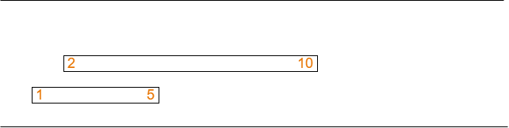

# Note
Ignore all the source file please.
# Problem
The problem of the second task of A2P2 is equivalent to this problem:  
Maintain a set of segments. Each segment is presented as a pair of number **[s, t)**. You have to process 3 kinds of query
- Add segment **[s, t)** to the set (O(log(n)) time complexity).
- Remove segment **[s, t)** from the set (O(log(n)) time complexity).
- Find the maximun number of segments cover the same point (O(1) time complexity)

The set is empty at the beginning.
  
Example:  
The set at the beginning:  
  
The number of maximun segments cover the same point: 0

**add(1, 5)**.  
**add(2, 10)**. The set now is  
  
The number of maximun segments cover the same point: 2

**add(6, 15)**. The set now is  
  
The number of maximun segments cover the same point: 2

**remove(2, 10)**. The set now is  
  
The number of maximun segments cover the same point: 1

**remove(6, 15)**.  
**remove(1, 5)**. The set now is  
  
The number of maximun segments cover the same point: 0


# Solution
Instead of mataining a set of segments, we can just maintain a ordered set of points, each point has a value.   
- For the **add(s, t)** query, we convert it to adding a entry with ```key = s, value = 1``` and adding a entry with ```key = t, value  = -1```.
- For the **remove(s, t)** query, we convert it to removing a entry with ```key = s``` and removing a entry with ```key = t```.
- Finding the maximun number of segments cover the same point is equivalent to finding the maximun sum of all consecutive subsequence in the set.

NOTE: A subsequence is a sequence that can be derived from another sequence by deleting some or no or all elements without changing the order of the remaining elements.

Example:  
**add(1, 5)**  
**add(2, 10)**  
**add(6, 15)**  
  
The number of maximun sum of a consecutive subsequence is 2 (two first elements).

We implement the ordered set of points by implementing the AVL tree. Each node of the tree stores these additional following informations
- ```sum``` the sum of all elements in the subtree.
- ```lmax``` the maximum sum of all consecutive subsequences which start from the left (i.e. the consecutive subsequence whose the first element is the left most element in the subtree).
- ```rmax``` the maximum sum of all consecutive subsequences which end at the right (i.e. the consecutive subsequence whose the last element is the right most element in the subtree).
- ```res``` the maximun sum of all consecutive subsequence in the subtree.

Everytime change the structure of the subtree (adding element, reomoving element, rotating the subtree), we update those above informations by these formulas
- If the root has no right subtree and left subtree (the root is the leaf):
    - ```root->sum = root->value```
    - ```root->lmax = root->rmax = root->res = max(0, root->sum)```  
- If the root has only the left subtree:
    - ```root->sum = root->value + left->sum```
    - ```root->lmax = max(left->lmax, root->sum)```
    - ```root->rmax = max(left->rmax + root->value, 0)```
    - ```root->res = max(left->res, root->rmax)```  
- If the root has only the right subtree:
    - ```root->sum = root->value + right->sum```
    - ```root->lmax = max(right->lmax + root->value, 0)```
    - ```root->rmax = max(right->rmax, root->sum)```
    - ```root->res = max(right->res, root->lmax)```  
- If the root has both left subtree and right subtree:
    - ```root->sum = root->value + left->sum + right->sum```
    - ```root->lmax = max(left->lmax, left->sum + root->value + right->lmax)```
    - ```root->rmax = max(right->rmax, right->sum + root->value + left->rmax)```
    - ```root->res = max(max(left->res, right->res), left->rmax + right->lmax + root->value)```  

Maximun sum of all consecutive subsequence in the ordered set is just ```root->res``` with ```root``` is the root of the AVL tree. With this approach, we can fulfill all the time complexity constraints.

Because some segments may share the some endpoint (e.g. [1, 2) and [1, 3)), instead of storing entry with **key = s, value = 1** and **key = t, value = -1**, we store entry with **key = {s, t}, value = 1** and **key = {t, s}, value = -1**.
